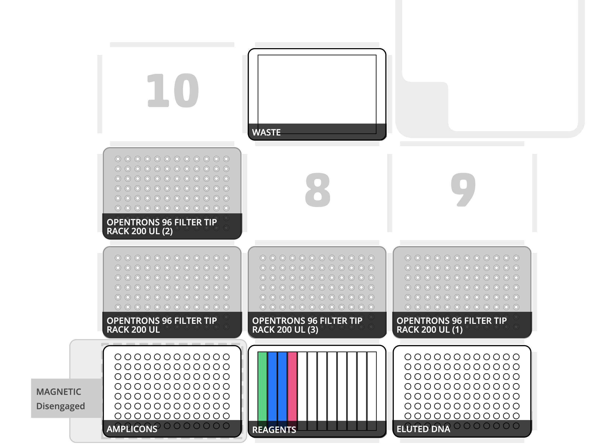

# Optional Protocol 4 - Ampure XP amplicon clean up

## Theory
If significant primer dimer formation has occured, these will be quantified by the picogreen assay and lead to poor normalization. If >=25 cycles of PCR have been run during primary PCR, or if during QC, significant primer dimers are observed then this protocol is recommended. Depending on the ratio of beads to DNA volume, a size selection is possible which will remove small DNA. This protocol is set up to use a 1.8x volume; however, this can be adjusted in the script. The defaults in the script will assume you have 50ul amplicon to clean up and will use 90ul beads (1.8x).

## Note
When making fresh 70% ethanol, do not add ethanol and fill the rest of the volume with water because this will lead to the incorrect ethanol percentage. Instead, add 70 mL of ethanol and 30 mL of water for a total volume of 100 mL of 70% ethanol.

## Automated Method

### Materials
- [ ] Ampure XP clean up beads (A63881) *Note: these can be made from scratch for significantly cheaper but may have less consistent size-selection properties*
- [ ] [Opentrons OT2](https://opentrons.com/ot-2)
- [ ] [Opentrons 8-channel 300ul pipette head mounted on right (Gen2)](https://shop.opentrons.com/collections/ot-2-robot/products/8-channel-electronic-pipette)
- [ ] [Opentrons Magnetic Capture Module (Gen2)](https://opentrons.com/modules/magnetic-module/)
- [ ] 4 x [Opentrons filter 200ul tips](https://shop.opentrons.com/collections/opentrons-tips/products/opentrons-200ul-filter-tips)
- [ ] 1 x  Nest 12 Well Reservoir 15 mL (Nest 360112)
- [ ] 1 x Nest 1 Well Reservoir 195 mL (Nest 360113) **OR** use an empty tip box lid
- [ ] 100% Ethanol
- [ ] Nuclease Free Water
- [ ] Bio-Rad 96 Well Plate 200 µL skirted PCR plate  (Biorad hsp9601) 

### Protocol
- [ ] Prepare fresh 70% ethanol and put in columns 2 and 3 of the 12 well reservoir.
- [ ] Add appropriate volume of beads to well 1 and ensure they are well mixed (bead volume/sample * Nsamples * 1.2)
- [ ] Add appropriate volume of water to well 4 (elution volume * Nsamples * 1.2)
- [ ] Set up OT2 according to Figure 1 below.
- [ ] Obtain a copy of scripts/O4_AmpureXPWash.py
- [ ] Modify lines 15-28 as required with close attention to desired bead volumes and elution volumes.
- [ ] Calibrate all deck positions and run method. **Estimated run time X min**
- [ ] After execution dispose of waste and clean out tip container

## Manual Method
### Materials
- [ ] Ampure XP clean up beads (A63881) *Note: these can be made from scratch for significantly cheaper but may have less consistent size-selection properties**
- [ ] 8x300ul multichannel
- [ ] 4 boxes of 200µL filtered tips (Opentrons 999-00081)
- [ ] 100% Ethanol
- [ ] Nuclease Free Water
- [ ] Bio-Rad 96 Well Plate 200 µL skirted PCR plate  (Biorad hsp9601) OR  TemPlate Semi-Skirt 0.2mL PCR Plate (USA Scientific 1402-9200)
- [ ] 96 well plate magnetic stand (Life Tech DynaMag-96 side 12331D)
- [ ] Disposable nuclease free reservoirs

### Protocol
- [ ] Prepare fresh 70% ethanol
- [ ] Add 1.8x volume to each well and mix by pipette (ex 27ul beads to 15ul amplicons)
- [ ] Incubate 5 min at room temperature
- [ ] Capture on magnetic stand for 8 minutes or until clear
- [ ] Discard of supernatant
- [ ] Add 100µL ethanol to each well and let stand at least 30 seconds
- [ ] Remove superantant
- [ ] Add 100µL ethanol to each well and let stand at least 30 seconds
- [ ] Remove superantant
- [ ] Air dry for 30 minutes or until beads are dry
- [ ] Add 30uL nuclease free water and pipette to mix
- [ ] Incubate for 2 minutes at RT
- [ ] Capture beads for 2 minutes or until cleared
- [ ] Remove supernatant (containing DNA) to new 96 well plate to carry forward.

## Figures

 **Figure 1.** OT-2 deck layout. Deck positions are sequentially numbered 1-11 from the bottom left to the top right. **Position 1**: Amplicons to be cleaned in 96 well biorad PCR plate sitting on top of magnetic module. **Position 2**: 12 well reservoir, first column contains magbeads, second and 3rd 70% ethanol, 4th nuclease free water. **Position 3**: Empty 96 well biorad PCR plate to collect final DNA. **Positions 4-7**: 200ul filter tips. **Position 11**: Waste container (either an upside down tip lid or a single channel reservoir. **Pipettes*: 300ul multichannel on right mount.
